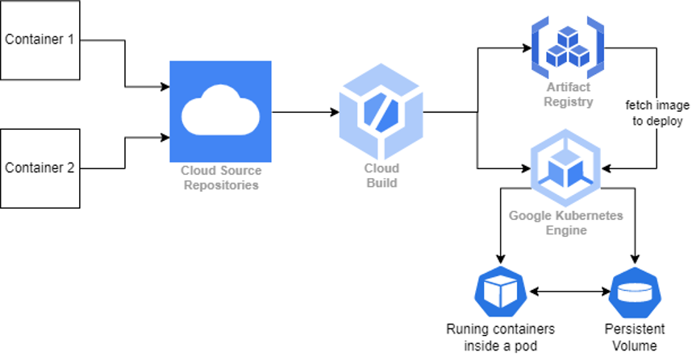
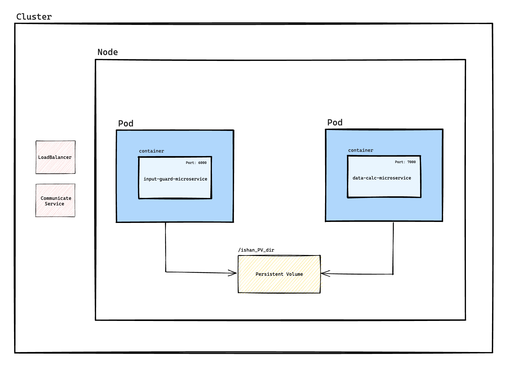

## Objective

The objective is to demonstrate proficiency in containerization, CI/CD pipelines, and Google Kubernetes Engine (GKE) on Google Cloud Platform (GCP).

## Workflow

The workflow involves creating a GKE Cluster using Terraform and hosting microservice codebases on Cloud Source Repositories. Upon a code change event, Cloud Build is triggered to build and push the image to the Artifact Registry. Subsequently, the updated image is used to deploy containers within a pod in GKE, while also attaching a persistent volume to ensure durable storage. This integrated workflow streamlines the process of continuous integration and deployment.

## Cluster

The architecture consists of a Kubernetes cluster (GKE) with one node. Within the node, two pods are deployed, each containing a single container. Both containers have a persistent volume attached for shared storage. To expose the application to the internet, a Load Balancer service is set up. Additionally, a Communicate Service enables seamless communication between the containers, facilitating data exchange.

